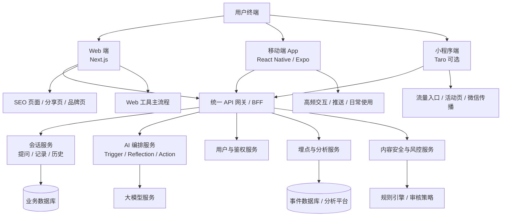

# 照见一念（Glimmer）前端技术选型方案

- 文档版本：V1.0
- 日期：2026-03-06
- 适用范围：Web 首发、跨端扩展、研发立项决策
- 目标：明确照见一念（Glimmer）的前端技术路线，给出框架决策依据、对比结论与推荐架构

---

## 1. 项目背景

照见一念（Glimmer）是一款围绕“启发 → 反思 → 行动”构建的轻量心理工具。产品既有明确的工具链路，也具备内容传播和 SEO 获客诉求。

当前产品形态包含以下典型页面与能力：

- 首页 / 品牌落地页
- 提问页 / 启发结果页
- 反思卡片页 / 深入回答页
- 总结与微实验页
- 每日卡牌页
- 历史记录页
- 问题模式与决策风格页
- 可分享结果页

从业务侧看，产品需要同时兼顾：

1. **SEO 与自然流量**
2. **快速迭代的 Web 首发能力**
3. **后续移动端与多端扩展能力**
4. **良好的交互体验与视觉表达能力**
5. **长期可维护性与工程成熟度**

因此，前端技术选型不能只看“跨端代码复用率”，而应综合考虑：

- SEO 能力
- Web 首发效率
- 跨端延展能力
- 团队协作成本
- 生态成熟度
- 性能与工程稳定性

---

## 2. 选型目标

## 2.1 核心目标

照见一念（Glimmer）的前端技术选型应满足以下核心目标：

### 目标 1：Web 首发友好

产品第一阶段需要快速上线 Web 端，验证：

- 产品链路是否成立
- 用户是否愿意完成“提问 → 反思 → 行动”流程
- 分享页、落地页、SEO 页面是否带来增长

### 目标 2：SEO 能力强

产品有明确的搜索流量和分享传播需求，因此需要：

- SSR（服务端渲染）
- SSG（静态生成）
- ISR / 增量静态更新
- 动态 metadata
- Open Graph / 分享卡片支持
- 良好的首屏性能

### 目标 3：跨端可扩展

中长期计划是跨平台多端，因此技术路线应能平滑支持：

- 响应式 Web
- H5
- iOS / Android App
- 平板端
- 潜在的小程序端

### 目标 4：工程可持续

要求：

- 组件体系容易沉淀
- 状态管理清晰
- AI 输出结构易接入
- 埋点、鉴权、国际化、监控有成熟方案
- 易于多人协作

---

## 3. 技术选型评估维度

建议用以下 8 个维度评估前端框架：

1. **SEO 能力**
2. **Web 首发效率**
3. **跨端扩展能力**
4. **组件与生态成熟度**
5. **开发体验与团队招聘友好度**
6. **性能与渲染能力**
7. **长期维护成本**
8. **与产品形态匹配度**

---

## 4. 候选方案概览

本轮重点比较以下三类方案：

1. **Next.js**（React 体系，Web 优先）
2. **Nuxt**（Vue 体系，Web 优先）
3. **Taro**（多端统一输出，业务端优先）

补充说明：

- Flutter 不作为本轮主选，因为其 Web SEO 先天不占优
- 纯原生多端方案不适合作为当前首发策略
- uni-app 可作为 Taro 的同类参考，但不作为本次主决策对象

---

## 5. 方案分析

## 5.1 方案一：Next.js

### 定位

基于 React 的全栈 Web 框架，适合构建具备 SSR / SSG / ISR 能力的现代 Web 应用。

### 优势

#### 1. SEO 能力最强

Next.js 对照见一念（Glimmer）最重要的优势是 SEO：

- 天然支持 SSR、SSG、ISR
- 适合品牌页、内容页、工具页混合场景
- 动态 metadata 管理成熟
- 易于生成可分享页面和搜索友好的静态页面

#### 2. 非常适合 Web 首发

照见一念（Glimmer）的第一阶段重点是 Web 验证，Next.js 非常适合：

- 快速搭建营销页与产品主流程
- 易做分层路由
- 对结果页、专题页、每日卡牌页、洞察页都友好

#### 3. 生态成熟

- React 生态最完整
- 组件库选择多
- 动效、图表、表单、监控、埋点、鉴权方案成熟
- 适合后续引入设计系统

#### 4. 易延展到多端

虽然不能“一套 UI 代码跑所有端”，但可以共享较多技术资产：

- React 思维一致
- 后续可接 React Native / Expo
- 可与 Taro 并行拓展小程序
- 业务模型、接口层、状态设计、设计系统可以复用

### 劣势

- App 端不能直接复用 Web UI
- 真正全端统一开发成本仍然存在
- 需要 React 工程经验较强的团队

### 对本产品的适配判断

**非常高**。

照见一念（Glimmer）本质上是：

- Web 首发的内容 + 工具混合产品
- 对 SEO 和分享页面敏感
- 需要长期扩展多端

Next.js 与此高度匹配。

---

## 5.2 方案二：Nuxt

### 定位

基于 Vue 的全栈 Web 框架，具备 SSR / SSG 能力，适合内容型与平台型 Web 产品。

### 优势

#### 1. SEO 能力强

Nuxt 在 SEO 层面同样优秀：

- 支持 SSR、SSG
- 元信息管理成熟
- 内容型页面友好
- 对品牌页和工具页都适配良好

#### 2. Vue 开发体验友好

如果团队熟悉 Vue：

- 上手成本低
- 组件逻辑清晰
- 对中后台、内容站、Web 工具都友好

#### 3. 工程结构整洁

Nuxt 的目录与约定能力良好，适合快速搭建清晰的 Web 应用。

### 劣势

- 生态总体仍弱于 React
- 后续扩展到原生 App 时的路线没有 React 体系自然
- 若未来要同时做 React Native 或小程序，整体统一性偏弱

### 对本产品的适配判断

**中高**。

如果团队已有成熟 Vue 能力，Nuxt 是可行方案；但若从长期多端扩展看，通常不如 Next.js 稳妥。

---

## 5.3 方案三：Taro

### 定位

面向多端统一开发的跨端框架，可输出 H5、微信小程序、App 等多个平台。

### 优势

#### 1. 多端覆盖能力强

Taro 的最大优势是：

- 小程序、H5、App 等多端输出
- 适合国内业务型产品快速铺设渠道

#### 2. 跨端复用效率高

若产品重点在：

- 小程序
- H5 活动页
- 业务功能页

则 Taro 很有优势。

### 劣势

#### 1. 不适合作为 SEO 主站方案

照见一念（Glimmer）非常看重 Web SEO 和内容传播，而 Taro 在这方面不占优：

- 对搜索抓取天然不如 Next / Nuxt
- 更适合业务统一开发，不适合 SEO 主站
- 品牌落地页、内容页、增长页体验通常不如 Next / Nuxt

#### 2. Web 端表达力不如 Web 原生框架

- 复杂内容页、深留白页面、品牌感页面不如 Next / Nuxt 自然
- 工具链路可以做，但高级 Web 产品感往往较弱

### 对本产品的适配判断

**中等偏低，适合作为后续补充端，不适合作为首发主框架。**

---

## 6. Next.js vs Nuxt vs Taro 决策表

| 维度 | Next.js | Nuxt | Taro |
|---|---|---|---|
| SEO 能力 | 非常强 | 强 | 弱 |
| SSR / SSG 支持 | 非常成熟 | 成熟 | 不适合作为主 SEO 方案 |
| Web 首发效率 | 非常高 | 高 | 中 |
| 内容页 / 落地页表现 | 非常好 | 好 | 一般 |
| 工具型 Web App 适配 | 非常好 | 好 | 中 |
| 分享页 / 结果页生成 | 非常好 | 好 | 一般 |
| 多端扩展能力 | 高，可接 React Native / Expo / Taro | 中，需额外规划 | 高 |
| 小程序适配便利性 | 中，需要额外方案 | 中，需要额外方案 | 非常高 |
| 生态成熟度 | 非常高 | 高 | 中 |
| 招聘与团队通用性 | 非常高 | 高 | 中 |
| UI / 交互表达能力 | 非常强 | 强 | 中 |
| 长期维护性 | 高 | 高 | 中 |
| 与照见一念（Glimmer）匹配度 | **最高** | 高 | 中等偏低 |

---

## 7. 决策结论

## 7.1 推荐结论

### 主框架推荐：Next.js

理由：

1. **最利于 SEO**
2. **最适合 Web 首发验证**
3. **最适合内容型 + 工具型混合产品**
4. **最便于后续接 React Native / Expo 扩展 App**
5. **整体工程、生态、可持续性最强**

### 备选方案：Nuxt

适用于：

- 团队 Vue 能力明显强于 React
- 现阶段明确不会快速扩展 React Native
- 更强调 Web 内容与平台型开发效率

### 不建议作为首发主站：Taro

适用于：

- 小程序优先
- 国内渠道分发优先
- SEO 不重要
- Web 只是附属端

这与照见一念（Glimmer）的当前阶段不完全匹配。

---

## 8. 推荐技术路线

## 8.1 Phase 1：Web 首发验证期

### 推荐技术栈

- **Next.js**
- **TypeScript**
- **Tailwind CSS**
- **React Query / TanStack Query**
- **Zustand**（轻量状态）
- **Framer Motion**（动效）
- **shadcn/ui 或自定义 Design System**
- **Vercel / Cloudflare 部署**

### 目标

快速完成：

- 首页 / 提问页
- 启发结果页
- 卡片反思页
- 深入回答页
- 总结与微实验页
- SEO 品牌页
- 可分享结果页

### 原则

- 优先保证 Web 体验与 SEO
- UI 结构化，适配后续多端设计系统
- 页面级组件与业务逻辑分层

---

## 8.2 Phase 2：移动端产品化

### 推荐路线

- **React Native / Expo**

### 目标

将高频使用场景迁移到 App：

- 每日卡牌
- 快速提问
- 历史回看
- 决策风格洞察
- Push 通知与长期留存

### 复用内容

- TypeScript 类型定义
- API SDK
- 数据模型
- 埋点模型
- 设计语言体系
- Prompt 配置结构

---

## 8.3 Phase 3：微信生态 / 小程序扩展

### 可选路线

- **Taro**

### 适用场景

- 微信生态传播
- 小程序拉新活动
- 内容入口页
- 限定版轻量工具页

### 原则

- 小程序不作为首发主站
- 作为流量补充端与渠道端使用

---

## 9. 推荐技术架构图

下面给出基于照见一念（Glimmer）的推荐前端技术架构。



---

## 10. 推荐前端分层架构

建议在前端内部采用以下分层：

### 10.1 表现层

- 页面组件
- 布局组件
- 基础 UI 组件
- 动效与反馈组件

### 10.2 业务层

- 提问流程状态管理
- 情绪识别与模式选择状态
- 结果页与反思页渲染逻辑
- 历史记录与洞察页逻辑

### 10.3 数据层

- API SDK
- React Query 数据获取
- 请求缓存与错误处理
- 埋点上报

### 10.4 共享层

- TypeScript 类型定义
- 常量枚举
- 主题与 Design Token
- 工具函数
- AI 结构化结果适配器

---

## 11. 推荐工程目录示意（Web 端）

```text
src/
├─ app/
│  ├─ (marketing)/
│  ├─ ask/
│  ├─ session/[id]/
│  ├─ history/
│  ├─ insights/
│  └─ daily-card/
├─ components/
│  ├─ ui/
│  ├─ layout/
│  ├─ ask/
│  ├─ reflection/
│  ├─ action/
│  └─ insights/
├─ features/
│  ├─ session/
│  ├─ emotion/
│  ├─ reflection/
│  ├─ action/
│  └─ analytics/
├─ lib/
│  ├─ api/
│  ├─ analytics/
│  ├─ auth/
│  └─ utils/
├─ stores/
├─ styles/
├─ types/
└─ constants/
```

---

## 12. 风险与规避建议

## 12.1 只追求跨端统一，忽略 SEO

风险：

- Web 首发质量不足
- 搜索流量难起量
- 品牌落地页与分享页表现差

建议：

- 首发阶段优先 Next.js
- 跨端统一放在第二阶段优化

## 12.2 过早同时做太多端

风险：

- 研发资源被分散
- 产品验证变慢
- 设计系统还不稳定就开始多端复制

建议：

- 先做 Web
- 再做 App
- 最后做小程序补充

## 12.3 Web 页面和 App 页面逻辑分叉严重

风险：

- 后续维护成本增加
- 数据埋点和行为模型不统一

建议：

- 尽早统一 API 结构
- 统一会话模型和事件模型
- 把设计系统、类型定义、业务流程抽象清楚

---

## 13. 最终建议

### 推荐结论

> 对照见一念（Glimmer）而言，最优前端路线是：**Next.js 作为 Web 首发主框架，后续按业务节奏扩展 React Native / Expo，必要时再补 Taro 小程序端。**

### 选择理由总结

- Web 首发最快
- SEO 最强
- 适合内容传播与工具流程结合
- 工程和生态最成熟
- 最利于后续多端演进

---

## 14. 一句话总结

> 当前阶段，照见一念（Glimmer）最重要的不是“先统一所有端的代码”，而是先用最适合 SEO 和 Web 增长验证的框架把产品跑起来；从这个目标出发，Next.js 是最合理的主选。
