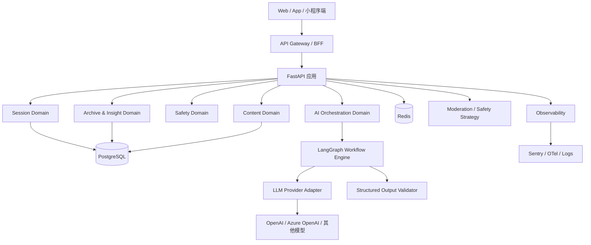

# 照见一念（Glimmer）后端技术选型方案

- 文档版本：V1.0
- 日期：2026-03-06
- 适用范围：MVP / Beta / 商业化前技术决策
- 设计依据：PRD、UI/UX 设计文档、前端技术选型方案、后端接口与数据结构设计文档
- 目标：明确照见一念（Glimmer）的后端技术路线，给出框架决策依据、推荐栈、阶段性架构与实施原则
- 关联文档：
   - [后端技术方案与实施文档-照见一念.md](后端技术方案与实施文档-照见一念.md)
   - [广告位配置与广告接入实施步骤.md](广告位配置与广告接入实施步骤.md)
   - [广告商业化产品方案与页面规划.md](广告商业化产品方案与页面规划.md)
   - [广告商业化接口契约草案.md](广告商业化接口契约草案.md)

---

## 1. 项目背景

照见一念（Glimmer）并不是一个普通 CRUD 工具，而是一个围绕“提问 → 启发 → 反思 → 行动 → 回看”构建的 AI 心理反思产品。

从现有产品与设计文档可以明确看出，后端需要同时满足以下特征：

1. **以会话为核心的状态推进**
   - 从提问草稿到情绪识别、模式选择、答案生成、卡片反思、总结行动，都是连续阶段。
2. **AI 驱动但必须结构化输出**
   - 前端不能依赖随意长文本，必须拿到固定字段：答案、提示、卡片、总结、偏差、行动建议。
3. **安全与风控优先**
   - 用户输入可能涉及情绪危机、高风险决策、自伤暗示，后端必须内建风险分流能力。
4. **需要长期沉淀数据资产**
   - 不只是返回结果，还要积累问题分类、情绪标签、卡片偏好、行动类型、洞察快照。
5. **需要和 Web 首发架构紧密配合**
   - 前端已明确采用 Next.js + TypeScript + React Query 路线，因此后端需要提供稳定的 OpenAPI 契约、清晰的会话接口与可生成 SDK 的结构。

因此，照见一念（Glimmer）的后端技术选型重点，不是单纯比较“谁更快”，而是比较：

- 谁更适合 AI 编排与结构化生成
- 谁更适合快速搭建会话式 API
- 谁更容易和前端形成强类型协作
- 谁更利于后续扩展历史记录、洞察分析与商业化能力

---

## 2. 选型目标

## 2.1 核心目标

### 目标 1：AI 能力接入友好

后端需要频繁处理：

- Prompt 编排
- LLM 调用
- 风险检测
- 文本分类
- 结构化输出校验
- 结果兜底

因此技术栈必须对 AI 生态友好，便于快速接入主流模型与内容安全能力。

### 目标 2：支持阶段式会话状态机

后端不能只是一个 `/chat` 接口，而要良好支撑：

- `draft`
- `context_ready`
- `answer_ready`
- `reflection_in_progress`
- `completed`
- `risk_blocked`

也就是说，框架与工程结构应天然适合构建清晰的领域模型与状态流转。

### 目标 3：结构化 API 与前后端协作顺畅

前端使用 Next.js 与 TypeScript，后端应具备：

- 明确的 OpenAPI 文档
- 稳定的 JSON Schema
- 便于生成 TypeScript SDK 的接口定义
- 清晰的一致错误码

### 目标 4：MVP 快速上线，后续可平滑演进

当前阶段最重要的是快速验证产品链路成立，因此后端需要：

- 上手快
- 工程可控
- 易于迭代
- 不过早陷入微服务复杂度

同时又要保留未来扩展到：

- 异步任务
- 洞察分析
- 用户体系
- 订阅付费
- 多端共享服务

### 目标 5：数据与安全可持续

后端必须支持：

- PostgreSQL 结构化存储
- Redis 缓存与限流
- 风险审计日志
- 埋点对账
- 任务重试与降级策略

---

## 3. 技术选型评估维度

建议从以下 8 个维度评估后端方案：

1. **AI 生态成熟度**
2. **接口开发效率**
3. **结构化数据与类型约束能力**
4. **异步任务与并发处理能力**
5. **与前端协作效率**
6. **数据库与工程生态成熟度**
7. **团队招聘与维护成本**
8. **与产品形态匹配度**

---

## 4. 候选方案概览

本轮重点比较以下三类方案：

1. **FastAPI（Python）**
2. **NestJS（TypeScript / Node.js）**
3. **Go + Gin/Fiber（Go）**

补充说明：

- Django 不作为本轮主选，因为照见一念（Glimmer）当前更偏 API + AI 编排系统，而不是以后台管理为核心的传统 Web 平台。
- Java / Spring Boot 不作为首发主选，原因主要是团队启动成本与 AI 实验效率不占优。
- 微服务不是本轮候选形态，而是未来演进形态；当前重点是先决定 **主语言 + 主框架 + 主存储 + 主任务模型**。

---

## 5. 方案分析

## 5.1 方案一：FastAPI

### 定位

基于 Python 的现代 API 框架，天然适合构建 AI 驱动、类型明确、文档自动生成的服务端系统。

### 优势

#### 1. 最适合 AI 编排与模型接入

照见一念（Glimmer）的核心能力在于：

- 问题分类
- 情绪识别
- 风险识别
- 结构化结果生成
- Prompt 版本管理

Python 在这些场景下优势最明显：

- LLM SDK 生态最成熟
- 文本处理与数据分析库最丰富
- 更适合快速试验不同模型、策略与规则引擎
- 与后续离线分析、主题聚类、用户画像推断衔接自然

#### 2. OpenAPI 与类型约束体验优秀

FastAPI + Pydantic 对本项目非常适配：

- 请求响应模型清晰
- 自动产出 OpenAPI 文档
- 易于和前端 TypeScript SDK 联动
- 能直接对 AI 结构化返回做二次校验

这对于“答案、卡片、总结、行动建议必须是固定字段”的产品要求非常关键。

#### 3. MVP 研发效率高

FastAPI 很适合快速搭建：

- 会话草稿接口
- 情绪/模式上下文接口
- 答案与卡片生成接口
- 反思提交接口
- 历史记录与洞察接口

并且更容易在同一项目内把：

- API 层
- 领域服务层
- AI 编排层
- 风控层
- 数据访问层

做成清晰的模块化单体结构。

#### 4. 足够支撑当前并发规模

对于 MVP / Beta 早期，FastAPI 的异步能力配合：

- `uvicorn`
- PostgreSQL
- Redis
- 后台任务队列

已经足够覆盖产品所需吞吐，不会成为首要瓶颈。

### 劣势

- 若团队只有前端 TypeScript 能力，Python 需要额外后端经验。
- 超大规模高并发下，Go 的纯性能上限更高。
- 若大量业务逻辑都希望与 Node 全栈统一，语言会有上下游切换成本。

### 对本产品的适配判断

**非常高。**

照见一念（Glimmer）是一个典型的“AI 编排重于纯业务 CRUD”的产品，FastAPI 与其能力核心高度匹配。

---

## 5.2 方案二：NestJS

### 定位

基于 TypeScript / Node.js 的企业级后端框架，强调模块化、依赖注入、工程规范与前后端语言统一。

### 优势

#### 1. 前后端统一 TypeScript 语言栈

若团队以前端工程师为主，NestJS 的优势在于：

- 上手门槛较低
- DTO、枚举、接口定义可与前端思维一致
- 工程规范清晰
- 与 Next.js 协作天然顺畅

#### 2. 模块化与工程治理成熟

NestJS 很适合构建：

- 会话模块
- 反思模块
- 安全模块
- 洞察模块
- 内容模块

对多人协作和长期维护比较友好。

#### 3. Web API 与业务平台能力强

如果产品未来更偏：

- 订阅计费
- 用户体系
- 管理后台
- 运营平台

NestJS 会是很稳健的选择。

### 劣势

- AI / NLP / 风险分析生态不如 Python 自然。
- 模型编排、离线分析、文本处理通常仍要绕回 Python 工具链。
- 若后续要做更复杂的主题聚类或画像分析，技术栈会分裂得更早。

### 对本产品的适配判断

**中高。**

如果团队明显偏 TypeScript，全栈统一诉求极强，NestJS 是可行备选；但从 AI 产品本质出发，整体仍弱于 FastAPI。

---

## 5.3 方案三：Go + Gin/Fiber

### 定位

高性能、低资源占用的后端方案，适合面向高并发、强稳定性和成本敏感场景的 API 服务。

### 优势

#### 1. 性能与并发能力强

Go 对以下场景很有优势：

- 高频短请求
- 高并发 API
- 后端资源成本优化
- 长期稳定运行

#### 2. 服务治理上限高

若产品未来进入大规模阶段，Go 在：

- 微服务拆分
- 任务调度
- 服务治理
- 资源利用率

方面表现优秀。

### 劣势

#### 1. 不适合作为 AI 首发主栈

照见一念（Glimmer）首阶段不是“高并发数据接口平台”，而是“高迭代 AI 产品”。Go 在以下方面不占优：

- LLM 实验速度
- Prompt 编排便利性
- 文本分析生态
- 安全策略试验效率

#### 2. 产品验证阶段开发成本更高

对 MVP 而言，Go 的工程收益通常要在更大规模时才明显，而首发阶段更需要“快试快改”。

### 对本产品的适配判断

**中等。**

适合作为未来某些高并发基础服务的补充，但不建议作为首发主后端框架。

---

## 6. FastAPI vs NestJS vs Go 决策表

| 评估维度 | FastAPI | NestJS | Go + Gin/Fiber |
|---|---|---|---|
| AI 生态成熟度 | 很强 | 中等 | 中等偏弱 |
| API 开发效率 | 很强 | 很强 | 中等 |
| 结构化输出校验 | 很强 | 强 | 中等 |
| 会话型状态机实现 | 强 | 强 | 中等 |
| 与前端契约协作 | 强 | 很强 | 中等 |
| 数据分析与画像扩展 | 很强 | 中等 | 中等 |
| 团队统一语言栈 | 中等 | 很强 | 弱 |
| 首发阶段综合适配度 | **最高** | 较高 | 一般 |

---

## 7. 决策结论

## 7.1 推荐结论

### 主框架推荐：FastAPI

理由：

1. **最适合 AI 编排型产品**
2. **最容易承接结构化结果与风控逻辑**
3. **最适合快速实现会话制接口**
4. **最利于后续做主题分析、画像、洞察与离线处理**
5. **与当前后端接口设计文档高度一致**

### 备选方案：NestJS

适用于：

- 团队 TypeScript 能力远强于 Python
- 短期内更重视全栈统一，而非 AI 迭代效率
- 预计后端更多是常规业务平台能力，而不是 AI 编排中枢

### 不建议作为首发主栈：Go + Gin/Fiber

适用于：

- 已验证业务成立后的高并发基础服务
- 网关、事件处理、极高吞吐场景
- 对性能成本极度敏感的成熟阶段

但这与照见一念（Glimmer）当前“AI 产品验证优先”的阶段不完全匹配。

---

## 8. 推荐后端技术栈

## 8.1 Phase 1：MVP 首发推荐栈

### 应用层

- **Python 3.11+**
- **FastAPI**
- **Pydantic v2**

### 数据层

- **PostgreSQL 15+**：主业务库，承载会话、答案、卡片、反思、行动、风险、洞察快照
- **SQLAlchemy 2.0**：ORM / 数据访问层
- **Alembic**：数据库迁移管理

### 缓存与异步层

- **Redis**：缓存、限流、幂等键、短期会话态、任务状态
- **同步接口 + 可扩展异步任务抽象**：MVP 先以同步生成为主，但在代码结构上预留任务接口

### AI 与集成层

- **LangGraph**：作为核心 LLM / Agent 工作流编排框架，承载节点、状态、分支与人工介入能力
- **统一 LLM Provider Adapter**：屏蔽不同模型供应商差异
- **结构化输出校验器**：对模型返回做 Pydantic 校验
- **安全规则引擎**：规则库 + 模型二次识别组合

建议分工：

- `FastAPI` 负责 API、鉴权、会话状态持久化与业务编排入口
- `LangGraph` 负责 Trigger / Reflection / Action / Safety 的工作流状态与节点流转
- `Pydantic` 负责对每个工作流节点输入输出做结构化约束

### 基础设施

- **Docker**：统一开发、测试、部署环境
- **Uvicorn**：ASGI 运行
- **Nginx / 托管平台网关**：反向代理与 HTTPS 入口

### 观测与质量

- **Sentry**：异常监控
- **OpenTelemetry**：链路追踪与性能观测
- **结构化日志（JSON Logging）**：便于审计与问题排查
- **Pytest + httpx**：接口与服务测试

---

## 8.2 Phase 2：Beta 扩展推荐

当进入 Beta，开始出现更明显的异步生成与统计计算需求时，建议新增：

- **Celery + Redis**：异步任务与重试
- **定时任务调度**：每日卡牌发布、洞察快照生成、内容预热
- **对象存储**：分享图、导出结果、静态生成素材
- **只读分析视图 / 聚合表**：提升历史与洞察页查询性能

此阶段仍建议保持 **模块化单体 + 独立 Worker**，而不是急于拆成多服务。

---

## 8.3 Phase 3：商业化与多端扩展

当业务进入订阅、留存、报表、推荐、画像阶段时，可考虑逐步拆分：

- `api-gateway / bff`
- `session-service`
- `ai-orchestrator`
- `safety-service`
- `insight-service`
- `billing-service`

如果商业化包含广告能力，建议在真正拆分服务前，先在模块化单体内预留：

- `monetization domain`
- `ad config service`
- `ad events ingest`
- `reward entitlement service`

但前提是：

- 团队规模已扩大
- 调用链稳定
- 指标证明单体已经成为真实瓶颈

在这之前，不建议为了“架构先进”而提前引入微服务复杂度。

---

## 9. 推荐技术架构图



---

## 10. 推荐后端分层架构

建议采用 **模块化单体（Modular Monolith）**，内部按域拆分：

### 10.1 Interface Layer

- REST API
- OpenAPI 文档
- 请求校验
- 鉴权与限流
- 统一错误返回

### 10.2 Application Layer

- 会话流程编排
- 阶段推进控制
- 幂等控制
- 事务边界
- 任务调度入口

这里建议把“业务流程编排”和“模型工作流编排”分开：

- 应用层负责接口触发、会话状态推进、数据库事务与权限控制
- `LangGraph` 负责 AI 节点之间的状态传递、条件分支、重试与人工介入

### 10.3 Domain Layer

- `Session`
- `Reflection`
- `Action`
- `Safety`
- `Insight`
- `Content`

这里承载核心业务规则，例如：

- 什么状态允许生成答案
- 什么条件允许提交反思
- 什么输入必须进入风险分流
- 什么行动建议才符合低风险约束

### 10.4 Infrastructure Layer

- PostgreSQL Repository
- Redis Cache / Rate Limit
- LLM Provider Adapter
- 审计日志
- 监控与告警

---

## 11. 与前端协作的接口契约建议

为了与 Next.js + TypeScript 路线保持一致，建议采用以下协作原则：

### 11.1 OpenAPI First

- 所有正式接口都由 Pydantic 模型生成 OpenAPI
- 前端基于 OpenAPI 生成 SDK 或类型定义
- 避免手写重复接口类型

### 11.2 固定结构优先于自由文本

例如答案生成，不返回“大段富文本”，而返回：

- `answerText`
- `hintText`
- `answerType`
- `cards[]`

总结阶段同理，返回：

- `summaryText`
- `cognitiveBiases[]`
- `futureSelf`
- `action`

### 11.3 错误码统一

需与前端共同对齐：

- `INVALID_INPUT`
- `SESSION_NOT_FOUND`
- `INVALID_SESSION_STATE`
- `RISK_BLOCKED`
- `RATE_LIMITED`
- `AI_TIMEOUT`
- `INVALID_AI_PAYLOAD`
- `INTERNAL_ERROR`

### 11.4 版本化接口

统一前缀：

- `/api/v1/...`

未来若字段结构发生重大调整，再通过 `v2` 演进，而不是在同一响应里长期兼容混乱字段。

### 11.5 商业化与广告接口预留

对应阅读：

- [广告位配置与广告接入实施步骤.md](广告位配置与广告接入实施步骤.md)
- [广告位配置与广告接入研发Checklist.md](广告位配置与广告接入研发Checklist.md)
- [广告商业化接口契约草案.md](广告商业化接口契约草案.md)

如果前端将采用“后端下发广告配置 + 前端统一广告容器 + 统一埋点上报”的模式，则后端接口设计应预留：

- 广告位配置读取接口
- 广告事件批量接收接口
- 激励广告权益领取接口
- 用户权益读取接口

这样可以保证：

- 广告频控与实验规则不写死在前端
- 会员去广告逻辑由后端统一裁决
- 广告埋点与业务埋点可以统一对账
- 后续切换广告平台时不影响前端页面结构

---

## 12. 推荐工程目录示意（后端）

```text
backend/
├─ app/
│  ├─ api/
│  │  ├─ deps/
│  │  ├─ routers/
│  │  └─ schemas/
│  ├─ core/
│  │  ├─ config.py
│  │  ├─ logging.py
│  │  ├─ errors.py
│  │  └─ security.py
│  ├─ domains/
│  │  ├─ session/
│  │  ├─ reflection/
│  │  ├─ action/
│  │  ├─ safety/
│  │  ├─ insight/
│  │  └─ content/
│  ├─ infrastructure/
│  │  ├─ db/
│  │  ├─ cache/
│  │  ├─ llm/
│  │  ├─ workflows/
│  │  ├─ moderation/
│  │  └─ telemetry/
│  ├─ workers/
│  └─ main.py
├─ migrations/
├─ tests/
├─ pyproject.toml
└─ Dockerfile
```

---

## 13. 数据与存储选型建议

### 13.1 主数据库：PostgreSQL

推荐理由：

- 关系模型清晰，适合会话、卡片、反思、行动等结构化数据
- `jsonb` 能容纳模型原始输出、标签与扩展字段
- 对统计查询、索引与事务支持成熟
- 与当前 `postgresql_schema_glimmer.sql` 方案完全一致

### 13.2 缓存与任务状态：Redis

推荐用于：

- 限流
- 短期缓存
- 幂等键
- 热门内容缓存
- 异步任务状态暂存

### 13.3 不建议 MVP 首发引入的组件

当前阶段不建议默认引入：

- Kafka
- Elasticsearch
- ClickHouse
- K8s 编排
- 多主数据库拆分

原因很简单：业务尚在验证阶段，复杂基础设施会显著拉高交付成本。

---

## 14. AI 编排与安全能力选型建议

### 14.1 AI 调用层

建议采用 **LangGraph + Provider Adapter** 的方式实现。

建议职责拆分如下：

- `LangGraph`：定义工作流图、节点状态、条件分支、失败回退与人工介入点
- `Provider Adapter`：屏蔽不同模型供应商差异
- `Pydantic Schema`：约束每个节点的输入输出结构

建议至少提供以下工作流：

- `trigger_workflow`
- `reflection_cards_workflow`
- `reflection_followup_workflow`
- `summary_action_workflow`
- `safety_check_workflow`

并为各工作流节点封装统一模型调用能力，例如：

- `generate_trigger_answer()`
- `generate_reflection_cards()`
- `generate_reflection_followup()`
- `generate_summary_and_action()`
- `classify_risk()`

这样可以把业务规则与模型调用解耦，便于：

- 用 `LangGraph` 实现可视化清晰的状态流转
- 切换模型供应商
- 做 A/B 测试
- 添加兜底模板
- 控制 Prompt 版本

### 14.2 为什么选择 LangGraph

对照见一念（Glimmer）这类产品，`LangGraph` 的适配点主要在于：

1. **天然适合有状态工作流**
   - 本产品本质不是单轮问答，而是会话式多阶段流程。
2. **适合条件分支**
   - 例如普通链路与 `risk_blocked` 安全分流链路。
3. **适合多节点结构化生成**
   - 可拆成分类、生成、校验、兜底、总结等节点。
4. **适合后续引入人工介入**
   - 例如运营审核、敏感结果复核、Prompt 灰度切换。
5. **与 Python / FastAPI 技术栈兼容性高**
   - 能保持整个后端 AI 编排层统一在 Python 生态内。

### 14.3 结构化输出校验

模型输出必须经过二次校验：

1. 字段完整性校验
2. 枚举值合法性校验
3. 文本长度与语气约束校验
4. 安全策略校验

如果校验失败：

- 触发重试
- 走兜底模板
- 记录审计日志

### 14.4 安全分流策略

建议采用“双层安全”机制：

- **规则前置**：关键词、模式、频控、场景判定
- **模型复判**：复杂语义风险识别

并且在以下时机触发：

- 创建会话前
- 提交反思前
- 生成最终总结前（可选抽检）

---

## 15. 部署与环境建议

## 15.1 MVP 阶段

推荐：

- Docker 容器化
- 单独后端服务部署
- PostgreSQL 托管实例
- Redis 托管实例

可选平台方向：

- Render
- Railway
- Fly.io
- 云厂商容器服务

原则：

- 先保证稳定上线
- 不追求过度复杂的自建运维
- 保证日志、监控、数据库备份可用

## 15.2 Beta 之后

当进入更明确的增长期，可再考虑：

- 独立 Worker 部署
- 灰度发布
- 多环境隔离
- 更精细的告警策略

---

## 16. 风险与规避建议

## 16.1 过早追求微服务

风险：

- 接口调试复杂
- 开发效率下降
- 团队沟通成本升高

建议：

- 首发采用模块化单体
- 先把会话状态机、AI 输出结构、安全分流跑通

## 16.2 只看全栈统一，忽略 AI 迭代效率

风险：

- 模型实验速度变慢
- 文本处理与分析能力受限
- 后续再补 Python 工具链时会二次拆分

建议：

- 优先围绕 AI 产品本质做主栈决策
- 前后端契约统一即可，不必强求同语言

## 16.3 AI 输出不做结构化约束

风险：

- 前端渲染不稳定
- 结果质量不可控
- 埋点与分析难以落地

建议：

- 所有模型输出必须有 Schema
- 模型返回后必须二次校验

## 16.4 安全策略后置

风险：

- 高风险内容混入正常链路
- 用户体验与平台责任风险上升

建议：

- 风险检查前置到会话创建与反思提交阶段
- 安全响应模板单独维护

---

## 17. 最终建议

### 推荐结论

> 对照见一念（Glimmer）而言，最优后端路线是：**以 Python + FastAPI + PostgreSQL + Redis 为核心，采用模块化单体架构首发，围绕结构化 AI 输出、会话状态机与安全分流构建后端能力。**

### 选择理由总结

- 最符合 AI 产品的研发重心
- 最容易实现结构化结果与风控闭环
- 最适合快速上线 MVP 并持续试验 Prompt 与策略
- 与现有接口设计、数据库设计、前端契约协作高度一致
- 后续能平滑扩展到异步任务、洞察分析与商业化能力

---

## 18. 一句话总结

> 照见一念（Glimmer）当前最需要的不是“最重的后端架构”，而是一个能够快速、稳定、可审计地承载 AI 反思会话的后端底座；从这个目标出发，FastAPI 路线最合理。